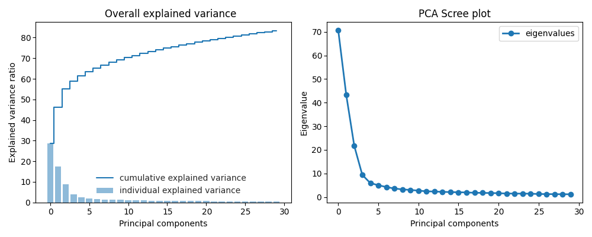
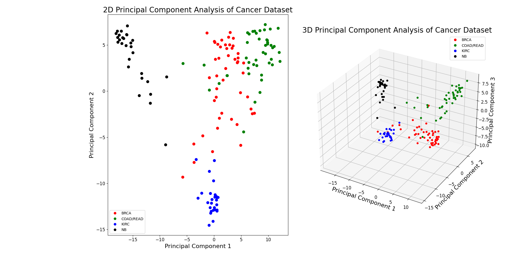
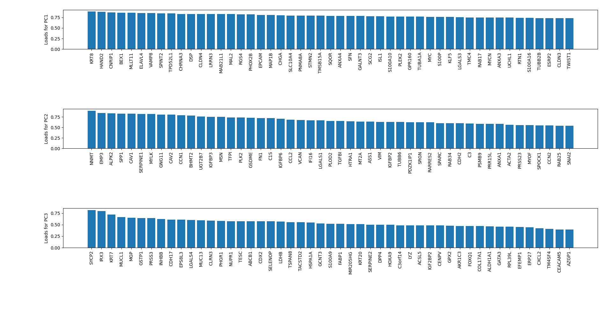

# Report

Report of 8CC00, first individual assignment on PCA.

Author: Rebecca Küpper  
ID_nr:  1008070  
Date:   27/2/2021

## Documentation 
The complete documentation of the code was created with Sphinx and can be found in docs/build/latex/8CC00_1.pdf

## Model and implementation
The model can be found in the home folder. It consists of three python scripts:
* AssignmentPCA.py
* CellLineRMAExpression.py
* main.py

where main.py is the main file and contains the PCA analysis itself. The AssignmentPCA.py script contains useful PCA tools and the CellLineRMAExpression.py script contains useful tool to use on the specific datasets. More information on the steps used to perform PCA can be found in the main module of the documentation.   
It was chosen not to use the pandas library, since it can be avoided easily and can be a pain in the backside. The only downside of not using the pandas library is that data has to be stored in both an array and a seperate list for labels, instead of a pandas dataframe.  

## Complexity analysis 
The computation of the coveriance matrix is terribly slow. This could've been made faster with the numpy `cov()` function, but the assignment prohibited this. The code that now determines the covariance matrix, calculates the covariance for each loaction in the matrix separately. However, the matrix is actually symmetric, so almost half of the calculations could've been avoided to speed things up. 

## Version control
Version control was done, as you've probably already found out by now, using git(hub). Since the requested code was not that complex, it was decided not to use separate branches for every feature, but rather commit all to main. 

## Interpretation of the results
With the main module, PCA was done. When the PC's were calculated, a bar graph of PC contribution and a scree plot were made to decide how many PC's were relevant. 

*Figure 1: left: Bar graph of PC contribution, right: Scree plot*

From Figure 1, it can be concluded that the first 3 PC's have a combined contribution of 55% and from the steep decline in the scree plot along the first three PC's it can be concluded that only the first three PC's are relevant.

Therefore, data could be converted to a new subspace and plotted for first the first 2 PC's in 2D and then all three PC's in 3D. 

*Figure 2: left: 2D PCA plot, right: 3D PCA plot with in red breast carcinoma, in green colorectal adenocarcinoma, in blue kidney renal clear cell carcinoma and in black neuroblastoma* 

From Figure 2, it can be observed that the data indeed clusters for each cancer type.  
In order to investigate how each gene contributes to each of the relevant PC's, a third figure was created in wich the load per gene for the highest 50 genes per PC is displayed per PC.

*Figure 3: Bar graphs of the 50 highest loads from the genes on the PC's. (Larger images can also be found separately in this folder.)*

It can be observed from Figure 3 that the genes differ a lot among the PC's. 
